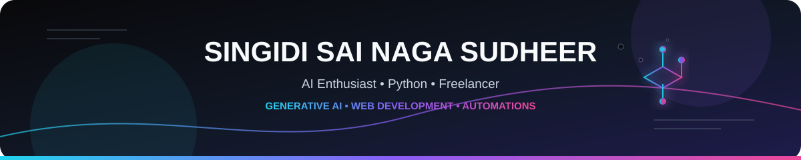

<!-- ==================== HEADER ==================== -->

<p align="center">
  
</p>

<table align="center">
  <tr>
    <td width="140" align="center">
      
    </td>
    <td width="650">
      <h2>Hi, I'm Singidi Sai Naga Sudheer 👋</h2>
      <hr>
      <p>
        AI Enthusiast &nbsp;•&nbsp; Python Developer &nbsp;•&nbsp; Freelancer<br>
        Building practical AI, web, and automation solutions
      </p>
    </td>
  </tr>
</table>

<br>

<p align="center">
  <b>
    Generative AI &nbsp;•&nbsp; Python &nbsp;•&nbsp; Web Development &nbsp;•&nbsp;
    Automations &nbsp;•&nbsp; Data & AI
  </b>
</p>

<br>

---

## `~/about` — A little about me

```yaml
name: Singidi Sai Naga Sudheer
education: Bachelor of Technology in Computer Science and Engineering (2022-2026)

interests:
  - Generative AI
  - Web Development
  - Automations
  - Content Writing

currently_focused_on:
  - Artificial Intelligence & Machine Learning
  - Generative AI applications
  - Full-Stack Web Development
  - AI-assisted development workflows
  - Building practical real-world solutions

goal: Build practical solutions and grow as an AI and software professional
```

---

## `~/experience` — Where I've worked

### 🤖 Seaok Innovations Private Limited — Data Science with AI Intern
**Hyderabad · February 2026 – June 2026**

- Developed professional dashboards and analytical solutions using Machine Learning techniques.
- Improved model efficiency by up to **70%** through data preprocessing, feature optimization, and performance tuning.
- Identified anomalies and hidden patterns in datasets to support better business decision-making.
- Worked on real-world AI and data-driven projects involving predictive analytics.

### 💻 Averixis Solutions — Web Development Intern (MERN Stack with AI)
**Bengaluru · October 2025 – December 2025**

- Developed and deployed startup-focused web applications using modern full-stack technologies.
- Built an LMS platform enabling **50+ students** to access study materials, learning roadmaps, and curated resources.
- Integrated AI-assisted development workflows to improve productivity and application quality.
- Generated revenue through personalized learning programs and mentorship-based educational services.

---

## `~/stack` — What I build with

<h3 align="center">— Languages —</h3>

<p align="center">
  
  
</p>

<h3 align="center">— AI / ML —</h3>

<p align="center">
  
  
  
  
  
  
</p>

<h3 align="center">— Web Development —</h3>

<p align="center">
  
  
  
  
</p>

<h3 align="center">— Database & Backend Services —</h3>

<p align="center">
  
  
  
</p>

<h3 align="center">— Tools & Platforms —</h3>

<p align="center">
  
  
  
  
  
  
  
</p>

---

## `~/projects` — Things I've built

### 🏥 HealthTrust-FL — Secure and Compliant Federated Learning

A secure healthcare data management system combining **Machine Learning, Federated Learning, and Blockchain** concepts for privacy-aware healthcare analytics and disease detection.

`Python` `Machine Learning` `Federated Learning` `Blockchain`

[💻 Source Code](https://github.com/Sudheer625/HealthTrust-FL-Secure-and-Compliant-Federated-Learning-/tree/main/health_trust_fl)

- Achieved **80% model accuracy** on disease detection.
- Enhanced data privacy through federated learning concepts and decentralized storage mechanisms.
- Used blockchain-based security architecture to support healthcare data integrity.

---

### 🍳 PantryChef AI

An AI-powered recipe generation platform that creates personalized recipes and step-by-step cooking instructions based on ingredients available in a user's kitchen.

`NextJS` `OpenRouter API` `Generative AI` `Vercel`

[🚀 Live Demo](https://pantrychefai.vercel.app/)

- Integrated the OpenRouter API for AI-powered recipe generation.
- Designed a responsive user experience using NextJS.
- Improved recipe discovery time by **40%**.

---

### 🚀 Karna Solutions

The official startup website for showcasing mentorship programs, training services, educational resources, and student-focused solutions.

`ReactJS` `Express` `Lovable` `Lovable Cloud`

[🚀 Live Demo](https://karna-solutions.lovable.app/)

- Built responsive landing pages and inquiry systems.
- Implemented student engagement modules and backend integrations.
- Designed scalable frontend components for a seamless user experience.

---

### 🎓 EduFun LMS

A learning management platform designed to organize and deliver higher-education resources through a centralized, accessible learning environment.

`ReactJS` `Express` `Lovable` `Lovable Cloud`

[🚀 Live Demo](https://edu-fun-hub.lovable.app/)

- Built responsive interfaces and modular backend components.
- Served **20+ active users** for content access.
- Improved accessibility of learning materials through a centralized platform.

---

## `~/achievements` — Highlights

🏆 **2nd Prize — GEN-AI Hackathon**  
ZentroByte Solutions, Srikakulam

🎯 **State Rank 296 — AP-PGECET**

🚀 **Founder, Mentor & Freelancer — Karna Solutions**

👨‍🏫 Conducted programming training sessions for students in **C and Python**

🧑‍💻 Developed full-stack web applications using **AI-assisted development tools**

🤝 Mentored students in academics and emerging technologies

⏱️ **Participant — GenAIVersity 48-Hour Hackathon**  
JNTU-GV

---

## `~/certifications` — Certifications

- 🐍 **Certified Python Developer — HackerRank**
- 🟨 **Certified JavaScript Developer — HackerRank**

---

## `~/github` — GitHub Activity

<p align="center">
  
  
</p>

<p align="center">
  
</p>

<p align="center">
  
</p>

<p align="center">
  
</p>

## `~/connect` — Find me online

<p align="center">
  <a href="https://github.com/Sudheer625">
    
  </a>
  &nbsp;
  <a href="https://www.linkedin.com/in/singidi-sai-naga-sudheer-9a701a2b1/">
    
  </a>
  &nbsp;
  <a href="https://ai-engineer-portfolio-7lpq3ltdg-team-karna.vercel.app/">
    
  </a>
</p>

<p align="center">
  <a href="mailto:singidisainagasudheer583@gmail.com">
    
  </a>
  &nbsp;
  <a href="https://www.hackerrank.com/profile/sudheergaming93">
    
  </a>
  &nbsp;
  <a href="https://leetcode.com/u/Sudheer-625/">
    
  </a>
</p>

<br>

---

```text
"Learn continuously — build practically — improve consistently."
```

<p align="center">
  <b>Thanks for visiting my profile! 🤖✨</b>
</p>

<!-- ==================== FOOTER ==================== -->

<p align="center">
  
</p>
